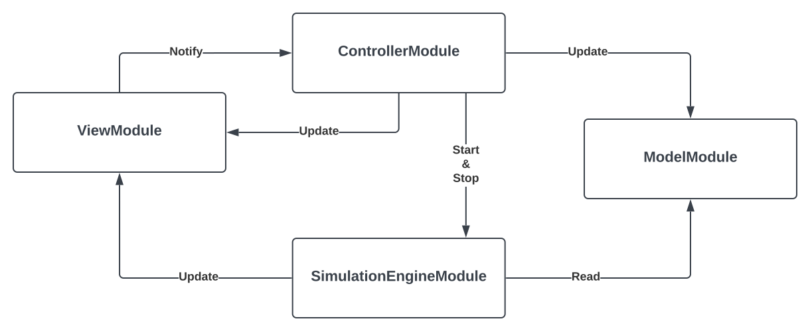

## Design architetturale

In seguito all'analisi dei requisiti dell'applicativo si è scelto di utilizzare un'architettura basata sul pattern `MVC` (Model - View - Controller), questo permette di incapsulare i compiti dei vari componenti in modo da rendere il programma altamente modulare e facile da modificare in futuro (e.g. a seguito della richiesta di utilizzo di un framework più moderno per la view). Nello specifico, data la natura del progetto, si è deciso di aggiungere un ulteriore componente, l' `engine` il cui compito è fornire l'implementazione della parte relativa ai calcoli della simulazione. Di seguito uno schema riassuntivo dell'architettura complessiva:

I compiti dei vari componenti sono:
- `model`: incapsula tutto il codice necessario a descrivere le entità del dominio dell'applicazione;
- `view`: incapsula le classi necessarie all'implementazione delle varie interfacce grafiche e della gestione gei grafici;
- `engine`: incapsula le classi necessarie all'evoluzione della simulazione;
- `controller`: incapsula il codice intermediario fra la view e il model e fra la view e l'engine.
