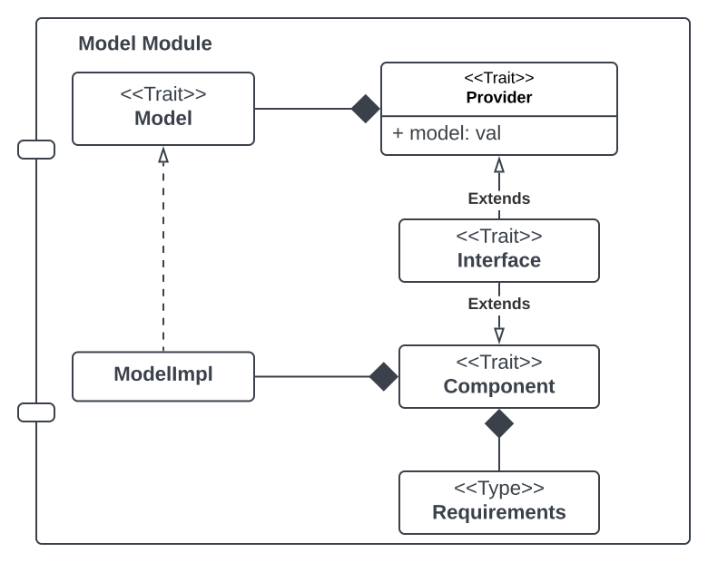
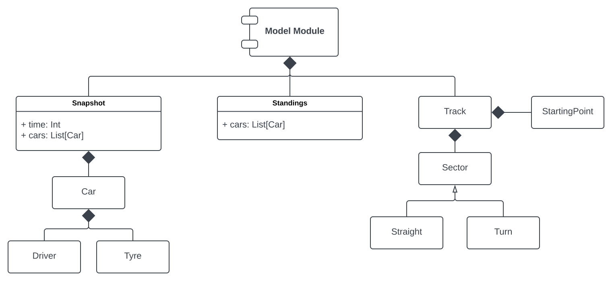
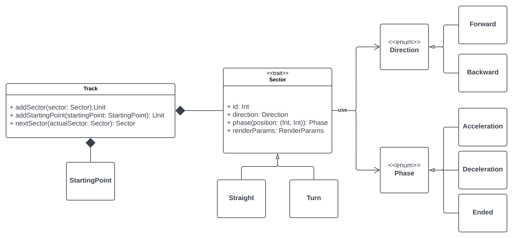
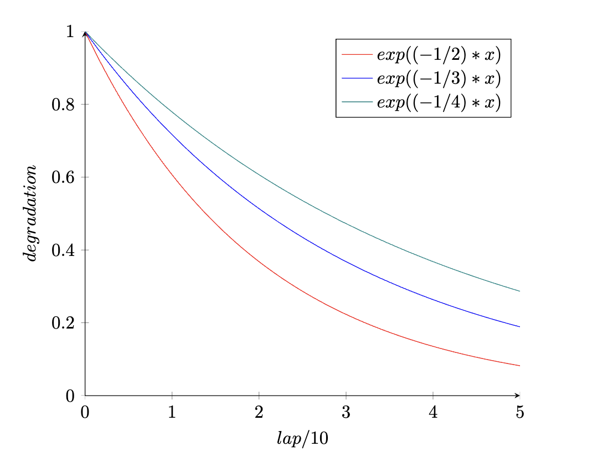
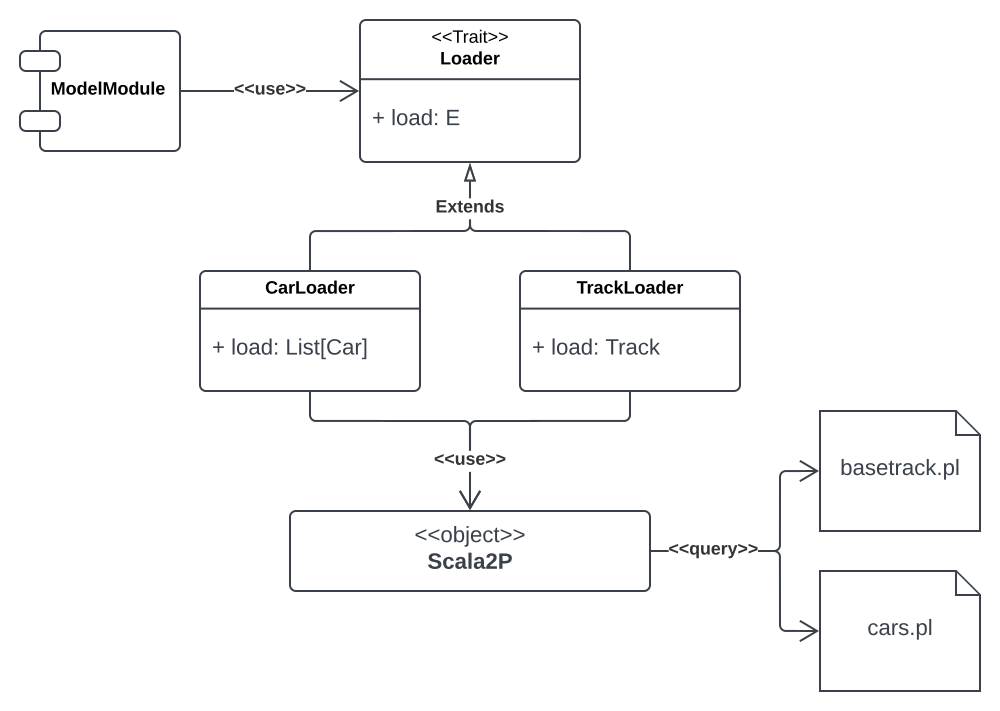
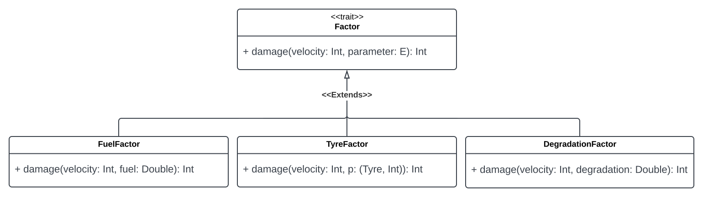
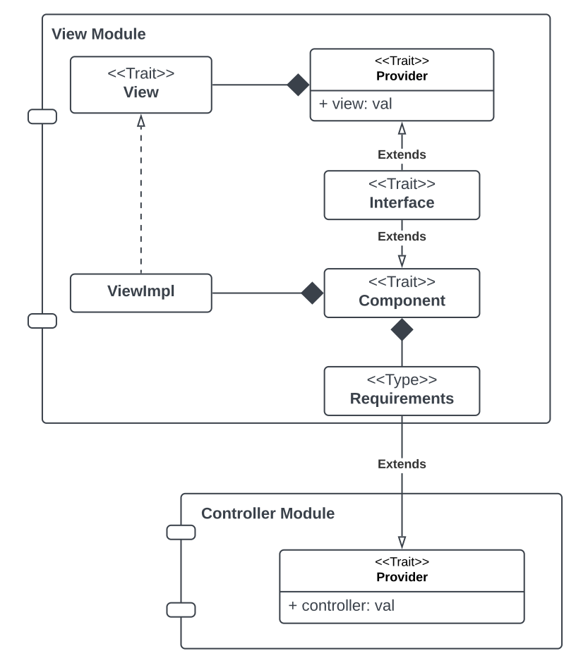
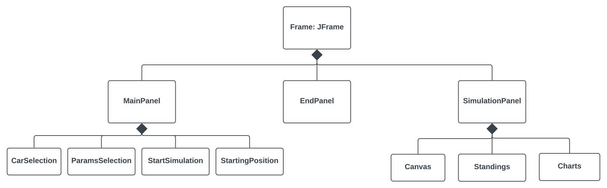
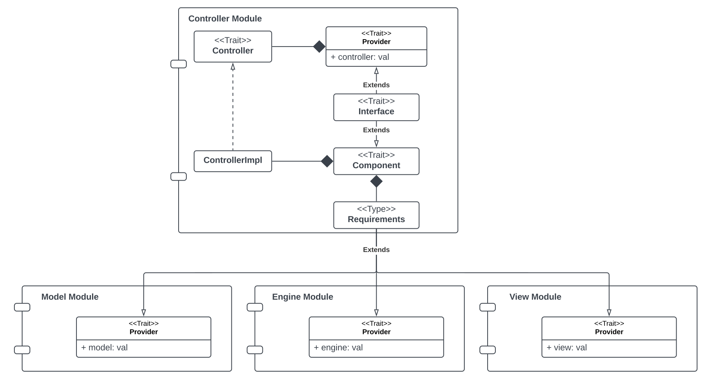
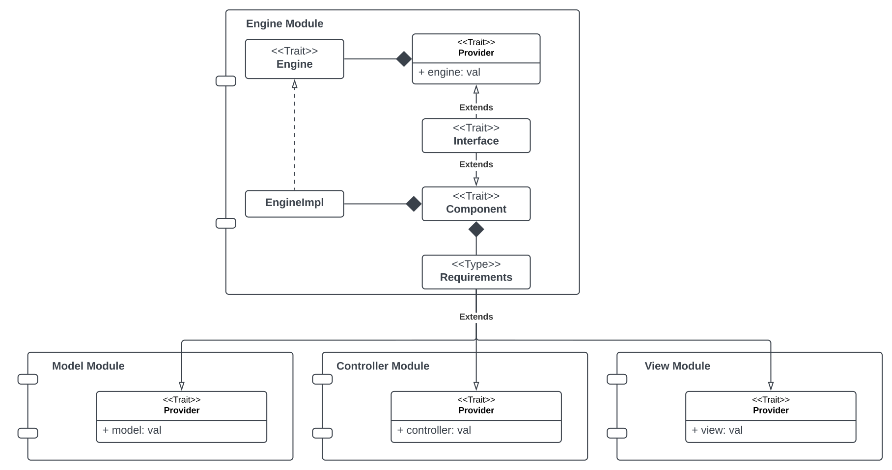

## Design di dettaglio

In questa sezione verrà analizzata nel dettaglio la struttura dell'applicativo andando a descrivere i singoli componenti e le relazioni fra loro.

### Component programming & Cake Pattern

Come descritto nella sezione precedente, si è deciso di utilizzare il pattern architetturale MVC. Per agevolare l'implementazione di questa scelta si è deciso di utilizzare il Cake Pattern, questo permette di iniettare le dipendenze fra i vari componenti in modo semplice e dichiarativo utilizzando aspetti avanzati della programmazione funzionale tra cui: *self-type*, *mix-in* e *type-members*. Nello specifico ogni componente che si desidera implementare deve avere cinque aspetti principali:
1. Un trait che definisce l'interfaccia del componente;
2. Un trait `Provider` che definisce il riferimento al componente tramite una singleton-like val;
3. Un type-member `Requirements` che definisce, in modo dichiarativo, le dipendenze di altri componenti di cui ha bisogno per svolgere i propri compiti (queste verranno mixed-in dai provider degli altri componenti in modo automatico);
4. Un trait `Component` che definisce l'implementazione effettiva del componente;
5. Un trait `Interface` che si occupa di aggregare gli altri elementi del modulo per renderlo effettivamente utilizzabile.

Un esempio di modulo view implementato utilizzando questo pattern è il seguente:

```scala
object ViewModule:

  trait View:
    def show(vitualTime: Int): Unit

  trait Provider:
    val view: View

  type Requirements = ControllerModule.Provider

  trait Component:
    context: Requirements =>
    class ViewImpl extends View:
      private val gui = MonadicGui()
      def show(virtualTime: Int): Unit = gui render virtualTime

  trait Interface extends Provider with Component:
    self: Requirements =>
```

Sfruttando questo pattern avanzato si è dunque deciso di implementare quattro moduli: Model, View, Controller ed Engine. Le dipendenze fra i vari moduli sono le seguenti: 
- View -> Controller
- Controller -> Model, Engine, View
- Engine -> View, Model, Controller

Di seguito è riportata una sezione per la descrizione dettagliata di ogni modulo.


### Model




#### Track
La classe `Track` rappresenta un generico circuito in cui le macchine possono gareggiare. Un circuito è modellato come una sequenza di settori `Sector`, ogni settore può essere un rettilineo `Straight` oppure una curva `Turn`. Un circuito è composto anche da una griglia di partenza che indica la posizione che le macchine hanno all'inzio della simulazione (in base all'ordine in cui si sceglie di farle partire). Tutti i dati relativi ai vari settori e agli starting point sono caricati da un file *Prolog* di configurazione.

Un settore ha una direzione `Direction` utilizzata per determinare come si devono muovere le varie macchine e una fase `Phase` utilizzata per determinare se una data macchina può accelerare o se deve diminuire la sua velocità perchè ad esempio si trova in prossimità di una curva.
 


#### Tyre
Tyre è una `enum` che rappresenta il tipo di gomme che una macchina può montare durante la gara. In base al tipo, la gomma, subirà un degrado variabile durante la gara. Il degrado di una data gomma ad un dato giro si può ottenere attraverso il metodo `degradation` presente nel companion object di Tyre, questo metodo effettua i calcoli utilizzando le seguenti funzioni:
<div align="center">

</div>
Nello specifico:
- Una gomma di tipo *Soft* subirà un maggior degrado, quindi, seguirà la funzione rossa;
- Una gomma di tipo *Hard* subirà un minor degrado, quindi, seguirà la funzione verde;
- Una gomma di tipo *Medium* subirà un degrado medio rispetto agli altri due tipi, quindi, seguirà la funzione blu.

#### Track & Cars Loader

Sia la pista di gara `Track` che le macchine `Car` vengono istanziate nel `ModelModule` a partire dai rispettivi file prolog. In questo caso prolog è stato utile come database per poter caricare le configurazioni di base. É, dunque, presente un trait `Loader` che viene esteso dalle classi `CarLoader` e `TrackLoader`, queste a loro volta utilizzano l'object `Scala2P` per potersi interfacciare con prolog ed ottenere quanto salvato nei vari file di configurazione.



#### Factors

Durante la simulazione la velocità di una singola macchina è influenzata da alcuni fattori limitanti, questi sono rappresentati dal trait `Factor` il quale espone un unico metodo `damage` utile per calcolare il danno provocato da quel fattore alla velocità. Questo trait è stato poi esteso da tre classi che rappresentano i tre fattori limitanti utilizzati: `FuelFactor`, `TyreFactor` e `DegradationFactor`.



### View


Il modulo View viene utilizzato come punto di accesso alla GUI dell'applicativo, questa è stata sviluppata utilizzando la libreria Swing. Dato che tale libreria è stata sviluppata nel contesto della programmazione ad oggetti si è pensato di utilizzarla in accoppiata con la libreria [Monix](https://monix.io/) per ottenere una definizione monadica e dichiarativa dei vari componenti. Ad esempio, la definizione di un componente può avvenire nel seguente modo:
```scala
private lazy val canvas =
      for
        cnv <- new Environment(CANVAS_WIDTH, CANVAS_HEIGHT)
        _ <- cnv.setPreferredSize(Dimension(CANVAS_WIDTH, CANVAS_HEIGHT))
        _ <- cnv.setVisible(true)
      yield cnv
```
Data la complessità delle varie schermate la gui è stata divisa, sfruttando la classe `JPanel`, in vari pannelli che vengono alternati a seconda delle azioni dell'utente. 


### Controller


### Engine


### Pattern utilizzati

#### Pimp my library

Pimp my library è un pattern che può essere utilizzato per aggiungere un nuovo metodo ad una classe senza modificare il suo codice, è molto utile quando tale classe viene da una libreria di terze parti e non si ha la possibilità di modificare il codice esistente. É stato usato per arricchire: *Interi*, *Tuple2*, *Option*, *HashMap* e *JPanel*. Un esempio esplicativo è il seguente, è sorta la necessità di avere un metodo per aggiungere una lista di elementi ad un pannello di classe `JPanel` senza scorrere esplicitamente tale lista, la soluzione dunque è stata arricchire la classe JPanel con il seguente metodo:
```scala
object RichJPanel:
    extension (p: JPanel)
      def addAll[E <: Component](elements: List[E]): Unit =
        elements.foreach(p.add(_))
```

#### Factory

Questo pattern è stato utilizzato nella sua versione classica in Scala, ovvero, utilizzando l'accoppiata trait - companion object per mantenere private le implementazioni di alcune classi. Ad esempio prendiamo un estratto della classe LineChart:
```scala 
trait LineChart:
  def addValue(x: Double, y: Double, series: String): Unit
 
object LineChart:

  def apply(title: String, xLabel: String, yLabel: String): LineChart =
    new LineChartImpl(title, xLabel, yLabel)

  private class LineChartImpl(_title: String, xLabel: String, yLabel: String) extends LineChart:
    ...

```

#### Facade

Facade è un pattern molto utile per nascondere la complessità di alcuni blocchi di codice, è stato utilizzato per fornire un'interfaccia semplificata per l'utilizzo dei grafici della libreria [JFreeChart](https://www.jfree.org/jfreechart/). Questa libreria, infatti, prevede l'utilizzo di diverse classi al fine di comporre un unico grafico (e.g. *ChartPanel*, *XYSeries*, *XYSeriesCollection*, ecc...). Grazie a facade siamo riusciti a fornire un'interfaccia più intuitiva e semplice da utilizzare evitando di sporcare la classe dove vengono creati i grafici e poi aggiunti al relativo pannello della GUI. I metodi esposti da questa implementazione sono i seguenti:

```scala 
/** Scala facade for a 2D JFreeChart Line Chart */
trait LineChart:
  def addValue(x: Double, y: Double, series: String): Unit
  def wrapToPanel: ChartPanel
  def addSeries(name: String, color: Color): Unit
  def title: String

```
#### Strategy

Il pattern Strategy è direttamente supportato in Scala dalla presenza delle funzioni higher-order. Un esempio di utilizzo è il seguente nel SimulationEngine:
```scala 
private def updateParameter[E](sector: Sector, onStraight: () => E, onTurn: () => E): E = sector match
        case s: Straight => onStraight()
        case t: Turn => onTurn()
```
Difatti, `updateParameter` è un metodo higher-order al quale possiamo "inniettare" dall'esterno la strategia da utilizzare.

#### Singleton

Esattamente come Strategy anche il pattern Singleton è direttamente supportato in Scala, questo pattern prevede che di una data classe si possa avere una e una sola istanza, questo obbiettivo è facilmente raggiungibile utilizzando gli `object`. Un esempio è il singleton `ImageLoader`:
```scala 
object ImageLoader:
  def load(file: String): ImageIcon = ImageIcon(ImageLoader.getClass.getResource(file))

```

#### Adapter

Il pattern Adapter viene utilizzato ogni qual volta si presenti un problema di incompatibilità fra due elementi distinti che devono coesistere all'interno del software. In Scala è facilmente implementabile attraverso il meccanismo delle `given conversion`. Nel progetto è stato molto utilizzato in diversi punti: costruzione di una view monadica e cooperazione Scala-Prolog.
```scala 
 given Conversion[JFrame, Task[JFrame]] = Task(_)
 given Conversion[JPanel, Task[JPanel]] = Task(_)
 given Conversion[String, Term] = Term.createTerm(_)
 given Conversion[Seq[_], Term] = _.mkString("[", ",", "]")
 ...
```
