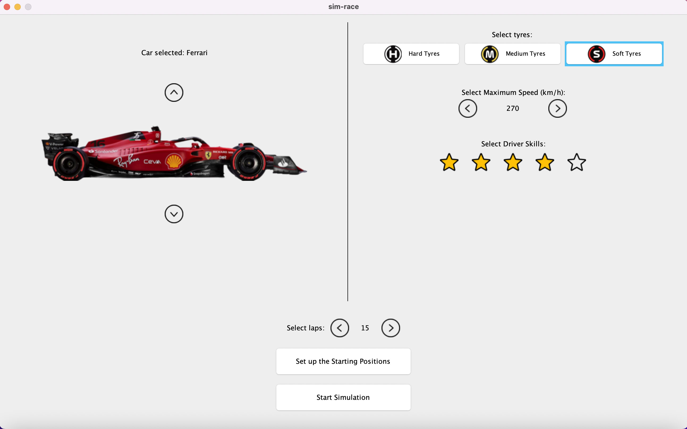
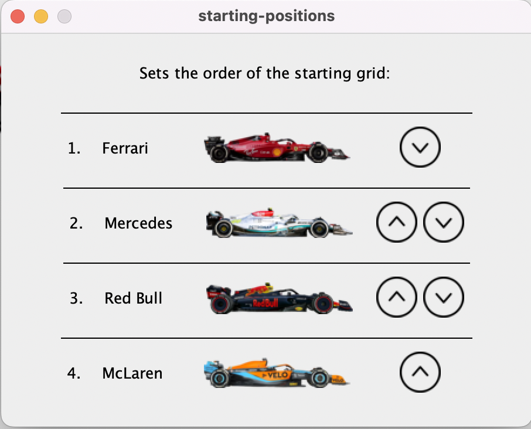
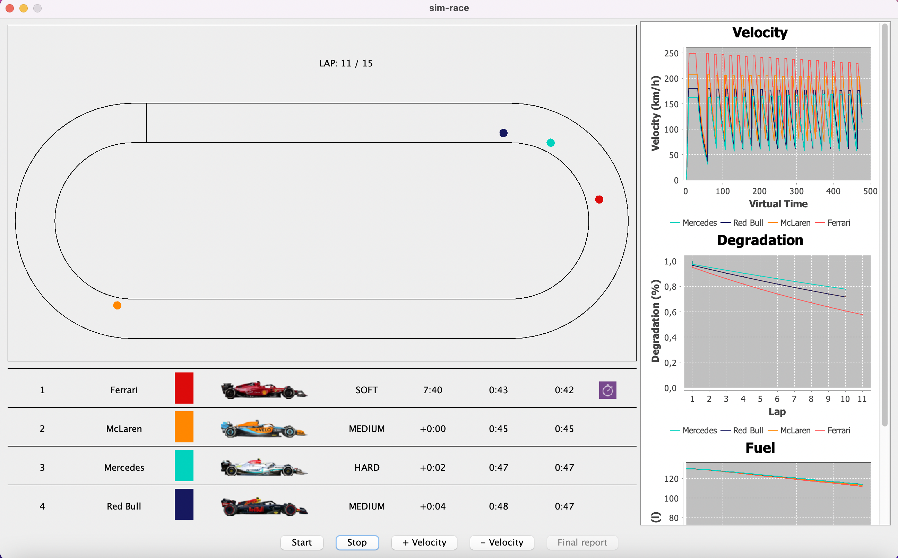
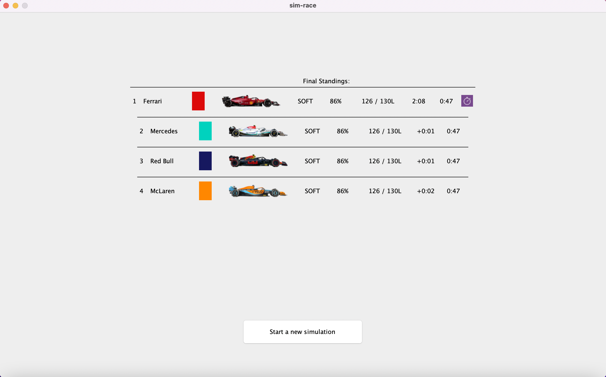

## Guida utente 

`pps-sim-race` può essere avviato in due diversi modi:
- Scaricando il file jar ed eseguendolo con il `java -jar <path-file-jar>`;
- Clonando il repository del progetto ed eseguendolo tramite `sbt` oppure importandolo in un IDE come Intellij.

Una volta avviato comparirà la seguente schermata utile per scegliere i parametri desiderati per la simulazione.

I parametri modificabili sono:
- Tipo di gomme, velocità massima e abilità del pilota per ogni macchina;
- Durata, in giri, della gara (minimo 1, massimo 30);
- Griglia di partenza, questa è modificabile da una schermata secondaria che appare premendo il pulsante `Set Up Starting Positions`.

Una volta premuto il pulsante `Start Simulation` si passerà nella schermata di simulazione.

In questa fase sarà possibile;
- Visualizzare lo stato della simulazione tramite una vista 2D dall'alto;
- Visualizzare alcuni parametri di interesse attraverso i grafici posti sulla destra;
- Visualizzare la classifica real time;
- Iniziare la simulazione con il pulsante `start`;
- Mettere in pausa la simulazione con il pulsante `stop` (sarà poi possibile riprendere sempre con `start`);
- Aumentare e diminuire la velocità della simulazione;
- Passare alla schermata con un report finale con il tasto `final report` (questo sarà disponibile solo quando la simulazione è terminata).

