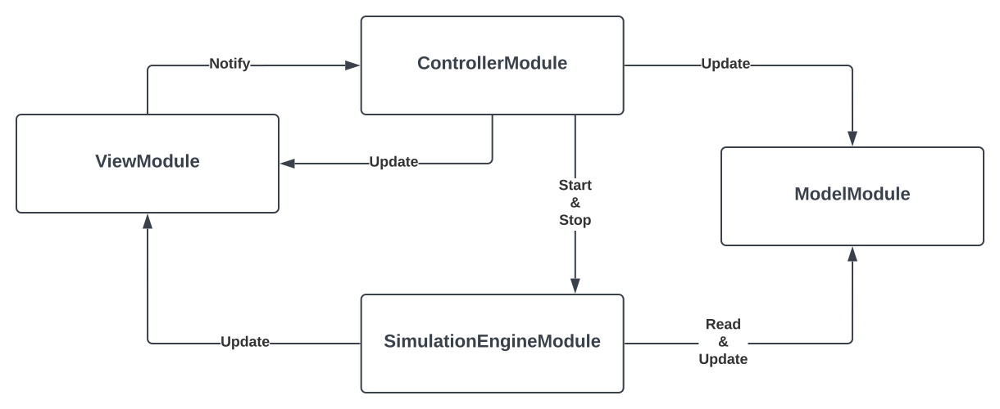
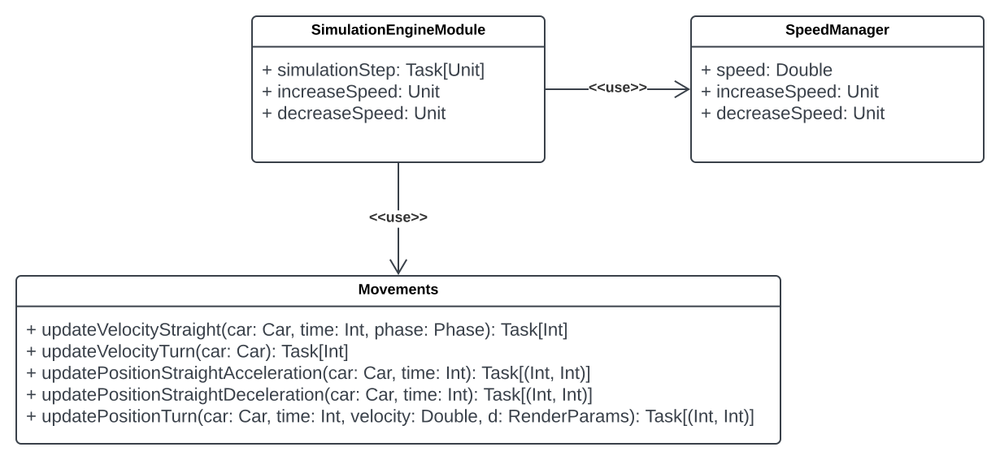
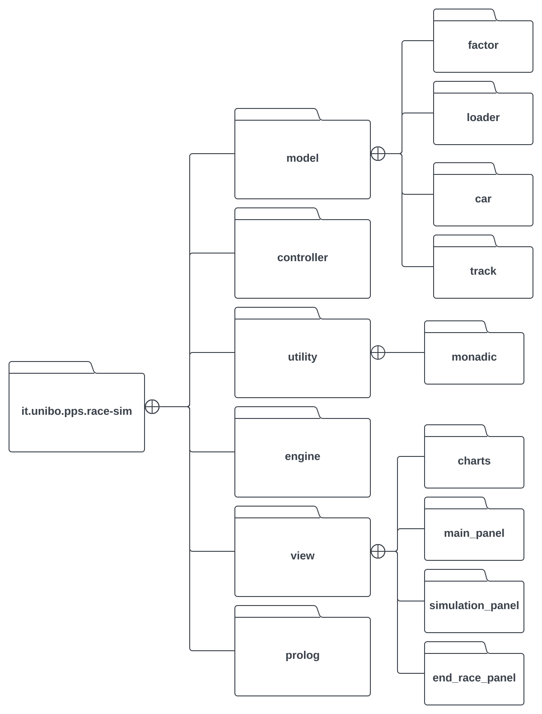

# Racing Simulator

## Autori

[Davide Domini](mailto:davide.domini@studio.unibo.it),
[Alessandro Magnani](mailto:alessandro.magnani18@studio.unibo.it),
[Andrea Matteucci](mailto:andrea.matteucci5@studio.unibo.it),
[Simone Montanari](mailto:simone.montanari14@studio.unibo.it)

## Indice

- [Introduzione](#introduzione)
- [Processo di sviluppo adottato](#processo-di-sviluppo-adottato)
- [Requisiti](#requisiti)
    - [Requisiti Business](#requisiti-business)
    - [Requisiti Utente](#requisiti-utente)
    - [Requisiti Funzionali](#requisiti-funzionali)
    - [Requisiti non Funzionali](#requisiti-non-funzionali)
    - [Requisiti di implementazione](#requisiti-di-implementazione)
- [Design architetturale](#design-architetturale)
- [Design di dettaglio](#design-di-dettaglio)

## Introduzione
`pps-sim-race` è un simulatore di gare di Formula1 che permette di studiare l'evoluzione di una gara al cambiare di alcuni parametri. Una volta fatto partire l'applicativo sarà presente una schermata iniziale con diversi parametri da poter modificare, tra cui: tipo di gomme di una data macchina, velocità massima della macchina, abilità del pilota, numero di giri della gara e griglia di partenza. Dopo aver avviato la simulazione sarà presente un pannello di rendering in cui poter visualizzare la posizione delle auto in pista, un pannello con una classifica aggiornata in real-time e una sezione dedicata a grafici riassuntivi (velocità, degrado gomme e carburante). Infine, una volta che tutte le vetture avranno tagliato il traguardo, sarà disponibile un pannello con alcuni dati riassuntivi della gara appena conclusa.

Nella versione base di questo simulatore sarà possibile:
- Far gareggiare quattro macchine in una pista predefinita; 
- Mettere in pausa e far riprendere la simulazione;
- Modificare la velocità della simulazione, saranno presenti tre velocità: normale, bassa e alta.

## Processo di sviluppo adottato
Il processo di sviluppo adottato prende ispirazione, per la maggior parte, da SCRUM (un framework iterativo e incrementale per lo sviluppo di software) con qualche contaminazione anche da Extreme Programming (XP). Nel caso specifico si è preso ispirazione da SCRUM per:
- Organizzazione di riunioni periodiche: (1) Sprint Planning (2) Daily Scrum (3) Sprint review;
- Artefatti: Product Backlog;
- Task: si è tenuto traccia dei task svolti dai vari componenti del gruppo.

Per quanto riguarda XP, invece, è stato adottato un approccio di Pair Programming, ovvero in molte fasi di sviluppo si è programmato a coppie; in una coppia sono presenti due ruoli:
1. Driver, colui che effettivamente scrive il codice;
2. Navigator, colui che pensa all'approccio da adottare per implementare una data feature. 


### Sprint 
Per gli sprint è stata scelta la durata di una settimana. Questa decisione è stata presa in modo da poter avere prototipi incrementali con l'aggiunta di poche feature alla volta, questo permette di poter validare spesso le nuove feature e individuare con rapidità potenziali fraintendimenti fra team di sviluppo e cliente. L'unico sprint di durata diversa è stato il terzo: questo è durato due settimane per permettere ai componenti del gruppo di lavorare solo a tempo parziale e non a tempo pieno.

All'inizio di ogni sprint è stata effettuata una riunione di circa due ore in cui sono stati assegnati i task della settimana ai singoli componenti del gruppo e in cui sono state decise le coppie di programmatori. 

Alla fine di ogni sprint è stata effettuata una riunione di circa due ore in cui si è discusso di quanto implementato, unito le varie feature ed effettuato la release di un prototipo (tutte le release si possono trovare [a questo indirizzo](https://github.com/davidedomini/pps-22-sim-race/releases)).


### Product Backlog 

Il Product Backlog è un artefatto che contiene tutte le funzionalità necessarie per la realizzazione e il corretto funzionamento dell'applicativo. Questo documento viene aggiornato nel corso dei vari Sprint Planning considerando le esigenze che vengono riscontrate con l'avanzamento del progetto. La sua struttura prevede:
- I macro task;
- Gli item di cui si compone ogni macro task;
- I link utili;
- Un punteggio, da 1 a 10, che rappresenta la difficoltà prevista per portare a termine un determinato item;
- Una sezione in cui poter indicare un punteggio di difficoltà revisionato dopo aver portato a termine il dato item.

### Flusso di lavoro

Per ogni task da svolgere durante un dato sprint è stata definita una scheda su [Trello](https://trello.com/it) in modo da poter tenere traccia dello stato di avanzamento delle varie feature.

Per quanto riguarda l'organizzazione del [repository GitHub](https://github.com/davidedomini/pps-22-sim-race) si è scelto di adottare `Git Flow`. Questo prevede l'utilizzo di diversi branch:
- Un branch `main` in cui è presente il codice delle varie release;
- Un branch `develop` da usare come branch principale;
- Un branch `feature/<nome-feature>` in cui è presente il codice necessario per implementare una determinata feature.

Un riassunto molto chiaro di questa metodologia di lavoro è dato nella seguente immagine:


Infine, si è deciso di utilizzare anche la [Conventional Commit Specification](https://www.conventionalcommits.org/en/v1.0.0/), in modo da uniformare la struttura dei commit fra i vari membri del gruppo.

### Strumenti utilizzati

I vari strumenti di supporto al lavoro utilizzati sono:
- *SBT*, per la build automation;
- *Trello*, per la divisione dei task;
- *ScalaTest*, per la scrittura dei test;
- *ScalaFMT*, per la formattazione del codice;
- *GitHub Actions*, per la continuous integration;
  - É stato definito un file YAML per descrivere la pipeline: ad ogni `push` o `pull` sul branch `main` o `develop` l'applicativo viene compilato e testato su diversi sistemi operativi (Windows, Ubuntu e macOS) con JVM 11.
- *Swing*, per la realizzazione dell'interfaccia grafica.

## Requisiti

### Requisiti Business
L'obiettivo del progetto è quello di sviluppare un simulatore di gare di Formula1. Il simulatore comprenderà un'interfaccia grafica che permetterà all'utente di interagire con il sistema. L'applicativo permetterà di modificare alcuni parametri inerenti la gara, nello specifico:
- Tipo di gomme usate;
- Velocità massima della vettura;
- Indice di abilità di un dato pilota.

Inoltre, una volta impostati tutti i parametri, verrà mostrata una nuova schermata che permette di visualizzare lo stato della simulazione e alcuni grafici di interesse. 

Una volta terminata la simulazione sarà possibile consultare una schermata riassuntiva e tornare alla schermata principale per effettuare nuove prove.

### Requisiti Utente
Di seguito sono riportati i requisiti visti nell'ottica di cosa può fare l'utente con l'applicativo.
- L'utente potrà visualizzare ed impostare i parametri legati alla simulazione;
- L'utente potrà visualizzare lo stato della gara mediante un'interfaccia 2D con vista dall'alto;
- L'utente potrà visualizzare la classifica real-time della gara;
- L'utente potrà visualizzare vari grafici che riassumono l'andamento della gara;
- L'utente potrà modificare la velocità della simulazione;
- L'utente potrà mettere in pausa e far ripartire la simulazione;
- L'utente potrà visualizzare la classifica con alcuni dati riassuntivi al termine della gara;
- L'utente potrà tornare al pannello principale per effettuare nuove simulazioni.

### Requisiti Funzionali
Di seguito sono riportati i requisiti individuati durante lo studio del dominio e le regole scelte per la sua rappresentazione.


- Il numero di vetture è fissato a 4;
- Il numero di circuiti è fissato a 1;
- Il numero di giri è impostabile nella schermata iniziale, potranno variare da un minimo di 1 ad un massimo di 30;
- Ogni vettura sarà caratterizzata da: 
    - Gomme, suddivise in:
        - Tipologia gomme;
        - Degrado delle gomme durante la gara;
    - Velocità della vettura, suddivisa in:
        - Velocità massima;
        - Velocità corrente;
    - Abilità di guida del pilota all'interno della vettura;
       
- L'usura delle gomme di ogni vettura aumenterà di giro in giro considerando la tipologia di gomma usata;
- La velocità corrente di ogni vettura sarà calcolata considerando la velocità massima, il carburante e l'usura delle gomme.


### Requisiti non Funzionali
Di seguito sono descritti i requisiti non funzionali dell'applicativo:

* ***Usabilità***: L'interfaccia grafica dovrà essere semplice ed intuitiva così da permettere ad un utente non esperto del dominio di comprendere quali sono le principali operazioni che può eseguire;
* ***User Experience***: L'interfaccia grafica sarà implementata in modo da rendere piacevole l'esperienza dell'utente;
* ***Cross Platform***: Sarà possibile eseguire il sistema sui 3 principali sistemi operativi: Linux, Windows, MacOs.


### Requisiti di implementazione
Di seguito vengono riportati i requisiti relativi all'implementazione del sistema:

* Il sistema sarà sviluppato in Scala 3.1.3 e per eventuali feature sarà possibile integrare delle teorie Prolog;
* Il sistema farà riferimento al JDK 11, eventuali librerie esterne utilizzate dovranno supportare almeno tale versione;
* Il testing del sistema sarà effettuato utilizzando ScalaTest, in questo modo sarà minimizzata la presenza di errori e facilitato l'aggiornamento di eventuali funzionalità;
* Il codice sorgente sarà verificato mediante l'utilizzo di ScalaFMT.

## Design architetturale
In seguito all'analisi dei requisiti dell'applicativo si è scelto di utilizzare un'architettura basata sul pattern `MVC` (Model - View - Controller), questo permette di incapsulare i compiti dei vari componenti in modo da rendere il programma altamente modulare e facile da modificare in futuro (e.g. a seguito della richiesta di utilizzo di un framework più moderno per la view). Nello specifico, data la natura del progetto, si è deciso di aggiungere un ulteriore componente: l'`engine`, il cui compito è fornire l'implementazione della parte relativa ai calcoli della simulazione. Di seguito uno schema riassuntivo dell'architettura complessiva:

I compiti dei vari componenti sono:
- `model`: incapsula tutto il codice necessario a descrivere le entità del dominio dell'applicazione;
- `view`: incapsula le classi necessarie all'implementazione delle varie interfacce grafiche e della gestione gei grafici;
- `engine`: incapsula le classi necessarie all'evoluzione della simulazione;
- `controller`: incapsula il codice intermediario fra la view e il model e fra la view e l'engine.

## Design di dettaglio
In questa sezione verrà analizzata nel dettaglio la struttura dell'applicativo andando a descrivere i singoli componenti e le relazioni fra loro.

### Component programming & Cake Pattern

Come descritto nella sezione precedente, si è deciso di utilizzare il pattern architetturale MVC. Per agevolare l'implementazione di questa scelta si è deciso di utilizzare il Cake Pattern, questo permette di iniettare le dipendenze fra i vari componenti in modo semplice e dichiarativo utilizzando aspetti avanzati della programmazione funzionale tra cui: *self-type*, *mix-in* e *type-members*. Nello specifico ogni componente che si desidera implementare deve avere cinque aspetti principali:
1. Un trait che definisce l'interfaccia del componente;
2. Un trait `Provider` che definisce il riferimento al componente tramite una singleton-like val;
3. Un type-member `Requirements` che definisce, in modo dichiarativo, le dipendenze di altri componenti di cui ha bisogno per svolgere i propri compiti (queste verranno mixed-in dai provider degli altri componenti in modo automatico);
4. Un trait `Component` che definisce l'implementazione effettiva del componente;
5. Un trait `Interface` che si occupa di aggregare gli altri elementi del modulo per renderlo effettivamente utilizzabile.

Un esempio di modulo view implementato utilizzando questo pattern è il seguente:

```scala
object ViewModule:

  trait View:
    def show(vitualTime: Int): Unit

  trait Provider:
    val view: View

  type Requirements = ControllerModule.Provider

  trait Component:
    context: Requirements =>
    class ViewImpl extends View:
      private val gui = MonadicGui()
      def show(virtualTime: Int): Unit = gui render virtualTime

  trait Interface extends Provider with Component:
    self: Requirements =>
```

Sfruttando questo pattern avanzato si è dunque deciso di implementare quattro moduli: Model, View, Controller ed Engine. Le dipendenze fra i vari moduli sono le seguenti: 
- View -> Controller
- Controller -> Model, Engine, View
- Engine -> View, Model, Controller

Di seguito è riportata una sezione per la descrizione di ogni modulo.


### Model


#### Track
La classe `Track` rappresenta un generico circuito in cui le macchine possono gareggiare. Un circuito è modellato come una sequenza di settori `Sector`, ogni settore può essere un rettilineo `Straight` oppure una curva `Turn`. Un circuito è composto anche da una griglia di partenza che indica la posizione che le macchine hanno all'inizio della simulazione (in base all'ordine in cui si sceglie di farle partire). Tutti i dati relativi ai vari settori e agli starting point sono caricati da un file *Prolog* di configurazione.

Un settore ha una direzione `Direction` utilizzata per determinare come si devono muovere le varie macchine e una fase `Phase` utilizzata per determinare se una data macchina può accelerare o se deve diminuire la sua velocità perchè, ad esempio, si trova in prossimità di una curva.
 


#### Tyre
Tyre è una `enum` che rappresenta il tipo di gomme che una macchina può montare. In base al tipo, la gomma, subirà un degrado variabile durante la gara. Il degrado di una data gomma ad un dato giro si può ottenere attraverso il metodo `degradation` presente nel companion object di Tyre, questo metodo effettua i calcoli utilizzando le seguenti funzioni:

<div align="center">

</div>

Nello specifico:
- Una gomma di tipo *Soft* subirà un maggior degrado, quindi, seguirà la funzione rossa;
- Una gomma di tipo *Hard* subirà un minor degrado, quindi, seguirà la funzione verde;
- Una gomma di tipo *Medium* subirà un degrado medio rispetto agli altri due tipi, quindi, seguirà la funzione blu.

#### Track & Cars Loader

Sia la pista di gara `Track` che le macchine `Car` vengono istanziate nel `ModelModule` a partire dai rispettivi file prolog. In questo caso prolog è stato utile come database per poter caricare le configurazioni di base. É, dunque, presente un trait `Loader` che viene esteso dalle classi `CarLoader` e `TrackLoader`, queste a loro volta utilizzano l'object `Scala2P` per potersi interfacciare con prolog ed ottenere quanto salvato nei vari file.


#### Factors

Durante la simulazione la velocità di una singola macchina è influenzata da alcuni fattori limitanti, questi sono rappresentati dal trait `Factor` il quale espone un unico metodo `damage` utile per calcolare il danno provocato da quel fattore alla velocità. Questo trait è stato poi esteso da tre classi che rappresentano i tre fattori limitanti utilizzati: `FuelFactor`, `TyreFactor` e `DegradationFactor`.


I fattori di limitazione per il carburante e il degrado sono calcolati come segue: 
- Fuel: `actual fuel / total fuel`
- Degradation: `1 - degradation`

Invece, il fattore di limitazione per il tipo di gomme è calcolato in modo più complesso per tenere conto delle dinamiche:
- Le gomme *SOFT* hanno una prestazione maggiore nei primi giri per poi essere molto limitate nel finale;
- Le gomme *MEDIUM* hanno una prestazione media costante;
- Le gomme *HARD* sono più limitate nei primi giri per poi alzare le prestazioni nel finale di gara.

Per realizzare questi comportamenti abbiamo usato le funzioni rappresentate nel seguente grafico:

<div align="center">

</div>

#### History
L'andamento della simulazione è rappresentato come una sequenza di `Snapshot` (uno snapshot per ogni iterazione), questi sono salvati nella classe `ModelModule`. Ogni snapshot contiene il relativo `virtualTime` e la lista di macchine aggiornate `cars`.

### View


Il modulo View viene utilizzato come punto di accesso alla GUI dell'applicativo, questa è stata sviluppata utilizzando la libreria Swing. Dato che tale libreria è stata sviluppata nel contesto della programmazione ad oggetti si è pensato di utilizzarla in accoppiata con la libreria [Monix](https://monix.io/) per ottenere una definizione monadica e dichiarativa dei vari componenti. Ad esempio, la definizione di un componente può avvenire nel seguente modo:
```scala
private lazy val canvas =
      for
        cnv <- new Environment(CANVAS_WIDTH, CANVAS_HEIGHT)
        _ <- cnv.setPreferredSize(Dimension(CANVAS_WIDTH, CANVAS_HEIGHT))
        _ <- cnv.setVisible(true)
      yield cnv
```
Data la complessità delle varie schermate la gui è stata divisa, sfruttando la classe `JPanel`, in vari pannelli che vengono alternati a seconda delle azioni dell'utente. 


### Controller


Il modulo `ControllerModule` funge da mediatore fra i moduli `ViewModule` e `ModelModule`. Oltre a fornire un accesso per la view al model implementa anche alcune logiche di funzionamento, come ad esempio:
- Avvio e stop della simulazione;
- Inversione dell'ordine delle macchine in partenza;
- Calcolo dei tempi di distacco fra le varie macchine.

### Engine


`SimulationEngineModule` è il componente che si occupa di gestire i calcoli necessari per computare l'evoluzione delle varie iterazioni. Il metodo principale esposto è `simulationStep`, questo viene richiamato dal controller e, grazie all'ausilio della libreria Monix, viene eseguito in modo asincrono.

Inoltre, il simulation engine, sfrutta due ulteriori classi:
- `SpeedManager`: per gestire la velocità della simulazione (Lenta, Normale, Veloce);
- `Movements`: per gestire i calcoli legati alle nuove velocità e alle nuove posizioni.


### Pattern utilizzati

#### Pimp my library

Pimp my library è un pattern che può essere utilizzato per aggiungere un nuovo metodo ad una classe senza modificare il suo codice, è molto utile quando tale classe viene da una libreria di terze parti e non si ha la possibilità di modificare il codice esistente. É stato usato per arricchire: *Interi*, *Tuple2*, *Option*, *HashMap* e *JPanel*. Un esempio esplicativo è il seguente: è sorta la necessità di avere un metodo per aggiungere una lista di elementi ad un pannello di classe `JPanel` senza scorrere esplicitamente tale lista, la soluzione dunque è stata arricchire la classe JPanel con il seguente metodo:
```scala
object RichJPanel:
    extension (p: JPanel)
      def addAll[E <: Component](elements: List[E]): Unit =
        elements.foreach(p.add(_))
```

#### Factory

Questo pattern è stato utilizzato nella sua versione classica in Scala, ovvero, utilizzando l'accoppiata trait - companion object per mantenere private le implementazioni di alcune classi. Ad esempio prendiamo un estratto della classe LineChart:
```scala 
trait LineChart:
  def addValue(x: Double, y: Double, series: String): Unit
 
object LineChart:

  def apply(title: String, xLabel: String, yLabel: String): LineChart =
    new LineChartImpl(title, xLabel, yLabel)

  private class LineChartImpl(_title: String, xLabel: String, yLabel: String) extends LineChart:
    ...

```

#### Facade

Facade è un pattern molto utile per nascondere la complessità di alcuni blocchi di codice, è stato utilizzato per fornire un'interfaccia semplificata per l'utilizzo dei grafici della libreria [JFreeChart](https://www.jfree.org/jfreechart/). Questa libreria, infatti, prevede l'utilizzo di diverse classi al fine di comporre un unico grafico (e.g. *ChartPanel*, *XYSeries*, *XYSeriesCollection*, ecc...). Grazie a facade siamo riusciti a fornire un'interfaccia più intuitiva e semplice da utilizzare evitando di sporcare la classe dove vengono creati i grafici e poi aggiunti al relativo pannello della GUI. I metodi esposti da questa implementazione sono i seguenti:

```scala 
/** Scala facade for a 2D JFreeChart Line Chart */
trait LineChart:
  def addValue(x: Double, y: Double, series: String): Unit
  def wrapToPanel: ChartPanel
  def addSeries(name: String, color: Color): Unit
  def title: String

```
#### Strategy

Il pattern Strategy è direttamente supportato in Scala dalla presenza delle funzioni higher-order. Un esempio di utilizzo è il seguente nel SimulationEngine:
```scala 
private def updateParameter[E](sector: Sector, onStraight: () => E, onTurn: () => E): E = sector match
        case s: Straight => onStraight()
        case t: Turn => onTurn()
```
Difatti, `updateParameter` è un metodo higher-order al quale possiamo "inniettare" dall'esterno la strategia da utilizzare.

#### Singleton

Esattamente come Strategy anche il pattern Singleton è direttamente supportato in Scala, questo pattern prevede che di una data classe si possa avere una e una sola istanza, questo obbiettivo è facilmente raggiungibile utilizzando gli `object`. Un esempio è il singleton `ImageLoader`:
```scala 
object ImageLoader:
  def load(file: String): ImageIcon = ImageIcon(ImageLoader.getClass.getResource(file))

```

#### Adapter

Il pattern Adapter viene utilizzato ogni qual volta si presenti un problema di incompatibilità fra due elementi distinti che devono coesistere all'interno del software. In Scala è facilmente implementabile attraverso il meccanismo delle `given conversion`. Nel progetto è stato molto utilizzato in diversi punti: costruzione di una view monadica e cooperazione Scala-Prolog.
```scala 
 given Component2Task[E <: Component]: Conversion[E, Task[E]] = Task(_)
 given Conversion[String, Term] = Term.createTerm(_)
 given Conversion[Seq[_], Term] = _.mkString("[", ",", "]")
 ...
```

### Struttura del codice
Il codice è stato strutturato in package come descritto nel seguente diagramma.


## Implementazione
In questo capitolo è presente una discussione delle scelte implementative effettuate dai membri del team di sviluppo.

### Programmazione funzionale

Dato il contesto di sviluppo di questo progetto si è cercato di utilizzare il più possibile il paradigma funzionale. Di seguito sono elencati alcuni aspetti ritenuti rilevanti per comprendendere come questo tipo di paradigma sia stato sfruttato.

#### For comprehension 
Questo costrutto è basato sulle monadi e risulta molto utile per aumentare la leggibilità del codice e limitare l'approccio imperativo. In questo progetto è stato utilizzato in accoppiata con i Task della libreria [Monix](https://monix.io/). Di seguito un metodo, estratto dalla classe `SimulationEngine`, che rappresenta un singolo step della simulazione:
```scala
override def simulationStep(): Task[Unit] =
  for
    _ <- moveCars
    _ <- updateStandings
    _ <- updateView
    _ <- waitFor(speedManager.simulationSpeed)
    _ <- checkEnd
  yield ()
```

#### Pattern matching
Questo meccanismo permette di eseguire un match fra un valore e un dato pattern, ha una sintassi particolarmente idiomatica ed è stato usato principalmente in due accezioni:
1. Nel modo classico, come fosse una sorta di switch di Java più potente. Ad esempio:
```scala
val alpha = direction match
    case Direction.Forward => 0
    case Direction.Backward => 180
```
2. Per decomporre un oggetto nelle parti che lo costituiscono. Ad esempio, è stato molto utile nella classe `CarsLoader`: dopo aver effettuato la query prolog per caricare tutte le macchine si hanno i parametri di una data macchina in una lista, ogni elemento di questa lista può essere selezionato in modo maggiormente comprensibile grazie a questo meccanismo come segue:
```scala
 private def mkCar(params: List[String], track: Track): Car = params match {
    case List(path, name, tyre, skills, maxSpeed, acceleration, actualSector, fuel, carColor) => 
      ...
```

#### Higher-order functions
Il meccanismo delle higher-order functions permette di implementare funzioni che prendono come input un'altra funzione (o in generale più di una) e/o ritornano una funzione. Questo permette di implementare in maniera molto semplice il pattern strategy ed aumenta il riutilizzo del codice. 
```scala 
private def updateParameter[E](sector: Sector, onStraight: () => E, onTurn: () => E): E = sector match
    case s: Straight => onStraight()
    case t: Turn => onTurn()
```

#### Option 
In programmazione funzionale la classe `Option` è utiizzata per rappresentare la possibile assenza di un valore, evitando di utilizzare il valore `null`. In questo progetto è stata utilizzata nella classe `ControllerModule`, l'esigenza era di rappresentare la presenza di un valore per la variabile `stopFuture` solo nel caso in cui la simulazione sia effettivamente stata fatta partire.
```scala 
private var stopFuture: Option[Cancelable] = None

override def notifyStart: Unit = stopFuture = Some(
  ....
)
```

#### Either

Questo meccanismo è utilizzato per gestire valori che potrebbero essere di due tipi diversi (disgiunti). Nel progetto è stato utilizzato in diversi contesti:
- _Controller_: per la gestione delle eccezioni si può usare un valore di tipo `Either[Throwable, A]`. Nel caso specifico è stato utilizzato dato che viene ritornato dal metodo `runAsync` dei Task di Monix. Una volta ottenuto un valore di questo tipo lo si può gestire con una partial function che esprime le computazioni da intraprendere nei due casi.
```scala
context.simulationEngine
    .simulationStep
    .loopForever
    .runAsync {
      case Left(exp) => global.reportFailure(exp)
      case _ =>
    }
```
- _View_: per poter gestire agevolmente il contenuto di alcune JLabel, questo potrebbe essere sia del testo che un'immagine.
```scala
private def createLabel(dim: Option[Dimension], f: () => Either[String, ImageIcon]): Task[JLabel] =
      for
        label <- f() match
          case Left(s: String) => JLabel(s)
          case Right(i: ImageIcon) => JLabel(i)
          ...
```

#### Mixins
Il meccanismo dei mixins permette di aggregare insieme più classi mediante composizione, invece che mediante ereditarietà. Un esempio di utilizzo è presente nella classe `ControllerModule`:
```scala
trait Interface extends Provider with Component:
```

### Programmazione asincrona

La programmazione asincrona è stata sfruttata per avere un'interfaccia responsive delegando le computazioni pesanti (e.g. la simulazione vera e propria) ad entità terze. Per raggiungere questo obiettivo sono stati sfruttati i Task di Monix. Un esempio di facile comprensione è il metodo `notifyStart` della classe `ControllerModule`:
```scala
override def notifyStart: Unit = stopFuture = Some(
    context.simulationEngine
      .simulationStep
      .loopForever
      .runAsync {
        case Left(exp) => global.reportFailure(exp)
        case _ =>
      }
)
```

### Programmazione reattiva
La programmazione reattiva è stata sfruttata per implementare l'aggiornamento automatico dei grafici, difatti, ogni volta che uno `snapshot` viene aggiunto alla `history` della simulazione viene, in automatico, richiamato il metodo di aggiornamento dei vari grafici. Anche questa parte è stata realizzata sfruttando le API di Monix. Nel `ModelModule`, che contiene la storia della simulazione, è necessario aggiungere tre elementi:
1. Un wrapper della `history` che rappresenta l'entità da osservare;
```scala
private var history: List[Snapshot] = List.empty
private val historySubject = ConcurrentSubject[List[Snapshot]](MulticastStrategy.publish)
```
2. Un metodo per sottoscrivere le callback su questo subject;
```scala
override def registerCallbackHistory(onNext: List[Snapshot] => Future[Ack], onError: Throwable => Unit, onComplete: () => Unit): Cancelable =
  historySubject.subscribe(onNext, onError, onComplete)
```
3. La chiamata al metodo di notifica del subject per comunicare una sua variazione, nel nostro caso ogni volta che viene aggiunto uno snapshot.
```scala
override def addSnapshot(snapshot: Snapshot): Unit =
  history = history :+ snapshot
  historySubject.onNext(history)
```

L'ultimo passo necessario è la chiamata effettiva al metodo per registrare la callback, questa avviene nel `ControllerModule`:
```scala
 override def registerReactiveChartCallback: Unit =
    val onNext = (l: List[Snapshot]) => 
      context.view.updateCharts(l)
      Ack.Continue
    val onError = (t: Throwable) => ()
    val onComplete = () => ()
    context.model.registerCallbackHistory(onNext, onError, onComplete)

```

### Programmazione logica
Il paradigma di programmazione logico è stato utilizzato, all'interno di questo progetto, per avere una sorta di database lightweight per fornire all'applicativo la pista e le vetture. Dunque se si volesse implementare una nuova pista basterebbe fornire un nuovo file prolog contenente le regole che descrivono i suoi settori, ad esempio:
  ```prolog
  straight(id(1), startPointE(181, 113), endPointE(725, 113), startPointI(181, 170), endPointI(725, 170)).
  ```


### Sezioni personali

#### Davide Domini
Nello sviluppo del progetto, inizialmente, mi sono occupato insieme a Matteucci della realizzazione della schermata per visualizzare l'andamento della simulazione. Questo comprende lo sviluppo delle classi:
- `SimulationPanel`;
- `Environment`;
- `TrackBuilder`;
- `CarsLoader`.

Successivamente, sempre in collaborazione con Matteucci, sono passato allo sviluppo della parte del `SimulationEngine` legata al movimento delle macchine durante la simulazione. Questo comprende le classi:
- `SimulationEngineModule`;
- `SpeedManager`
- `Movements`, per questa classe ho collaborato anche con Montanari per la gestione delle curve.


Infine, in autonomia, ho sviluppato:
- Gestione dei grafici, classe `LineChart` e aggiornamento automatico tramite programmazione reattiva;
- Object `PimpScala`, in cui vengono arricchite alcune entità esistenti come: Int, Tuple2, Option, HashMap e JPanel;
- Meccanismo per calcolare il degrado delle gomme;
- Start e stop della simulazione tramite programmazione asincrona.

#### Andrea Matteucci
Inizialmente ho collaborato insieme a Domini per realizzare la schermata per visualizzare l'andamento della simulazione. Le classi relative a questo sviluppo sono le seguenti:
- `SimulationPanel`;
- `Environment`;
- `TrackLoader`;
- `CarsLoader`.

Sempre cooperando con Domini, ho poi sviluppato le classi relative alla sezione `SimulationEngine`, che mira a gestire il movimento delle macchine durante la simulazione. Questa parte è composta dalle seguenti classi:
- `SimulationEngineModule`;
- `SpeedManager`;
- `Movements`;

In autonomia, ho poi lavorato sui seguenti aspetti:
- Costruzione della struttura della pista, all'interno della classe `Enviroment`;
- Meccanismo per la gestione del consumo di carburante, utilizzato nella classe `SimulationEngineModule`.

#### Alessandro Magnani
In un primo momento, ho sviluppato insieme a Montanari la schermata iniziale del simulatore, nella quale è possibile stabilire i parametri delle diverse macchine selezionabili, la griglia di partenza, il numero di giri della gara e i parametri relativi al singolo pilota. Le classi coinvolte sono le seguenti:
- `MainPanel`
- `CarSelectionPanel`
- `ParamsSelectionPanel`
- `StartSimulationPanel`
- `StartingPositionsPanel`

Successivamente, sempre cooperando con Montanari, ho implementato il numero di giri completati e la classifica in real-time con tutte le relative informazioni per ogni vettura all'interno del pannello della simulazione. Le implementazioni apportate coinvolgono le seguenti classi:
- `SimulationPanel`
- `Standings`
- `SimulationEngineModule`
- `UtilityFunctions`

Infine, sempre in collaborazione con Montanari, mi sono occupato del report finale della gara. Classi relative:
- `EndRacePanel`


#### Simone Montanari
Inizialmente, in collaborazione con Magnani, mi sono occupato della crezione della schermata iniziale del simulatore, dove è possibile impostare i parametri delle diverse macchine, la griglia di partenza ed il numero di giri della gara.
Classi relative:
- `MainPanel`
- `CarSelectionPanel`
- `ParamsSelectionPanel`
- `StartSimulationPanel`
- `StartingPositionsPanel`

Successivamente, in collaborazione con Domini, mi sono occupato dell'implementazione del movimento in curva delle macchine.
Classi relative:
- `SimulationEngineModule`
- `Movements`

Dopo aver implementato il movimento delle macchine, in collaborazione con Magnani, ho implementato la classifica in real-time della gara ed il numero di giri impostato inizialmente.
Classi relative:
- `SimulationPanel`
- `Standings`
- `SimulationEngineModule`
- `UtilityFunctions`

Infine, sempre in collaborazione con Magnani, mi sono occupato della realizzazione del report finale della gara.
Classi relative:
- `EndRacePanel`
      
## Sviluppi futuri
Per quanto riguarda gli sviluppi futuri il team di sviluppo ritiene che ci siano diversi aspetti che si possono approfondire e varie funzionalità che sarebbe interessante aggiungere o ampliare. Di seguito sono riportate alcune proposte:
- Possibilità di scegliere fra diversi circuiti di gara;
- Possibilità di settare nuovi parametri per le macchine, ad esempio, consumo (litri per km);
- Visualizzazione di ulteriori grafici;
- Inserimento di fattori disturbanti esterni, come ad esempio la pioggia;
- Possibilità di effettuare pit-stop durante la gara;
- Gestione delle collisioni fra vetture diverse.

## Guida utente
`pps-sim-race` può essere avviato in due diversi modi:
- Scaricando il file jar ed eseguendolo con il `java -jar <path-file-jar>`;
- Clonando il repository del progetto ed eseguendolo tramite `sbt` oppure importandolo in un IDE come Intellij.

Una volta avviato comparirà la seguente schermata utile per scegliere i parametri desiderati per la simulazione.

<div align="center">

</div>


I parametri modificabili sono:
- Tipo di gomme, velocità massima e abilità del pilota per ogni macchina;
- Durata, in giri, della gara (minimo 1, massimo 30);
- Griglia di partenza, questa è modificabile da una schermata secondaria che appare premendo il pulsante `Set Up Starting Positions`.

<div align="center">

</div>

Una volta premuto il pulsante `Start Simulation` si passerà nella schermata di simulazione.

<div align="center">

</div>

In questa fase sarà possibile;
- Visualizzare lo stato della simulazione tramite una vista 2D dall'alto;
- Visualizzare alcuni parametri di interesse attraverso i grafici posti sulla destra;
- Visualizzare la classifica real time;
- Iniziare la simulazione con il pulsante `start`;
- Mettere in pausa la simulazione con il pulsante `stop` (sarà poi possibile riprendere sempre con `start`);
- Aumentare e diminuire la velocità della simulazione;
- Passare alla schermata con un report finale con il tasto `final report` (questo sarà disponibile solo quando la simulazione è terminata).

<div align="center">

</div>


